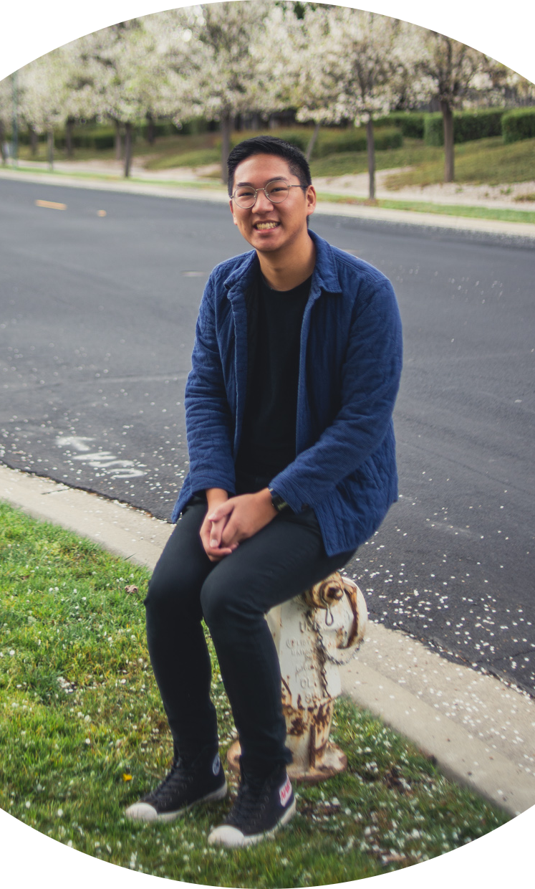

 
 
Hello! I am Jayke Nguyen and I graduated from UC Berkeley in 2018 with degrees in physics and astrophysics. I am currently working at Lawrence Livermore National Laboratory working on adaptive optics systems and measuring the parallax of nearby brown dwarfs.
